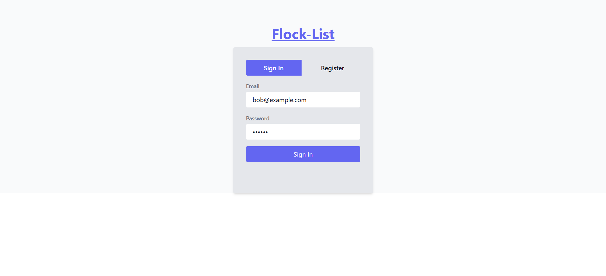
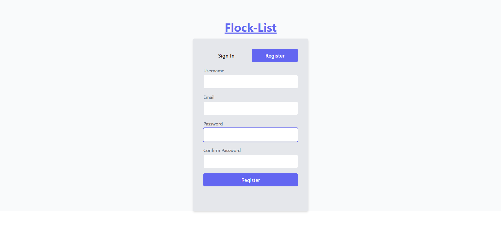
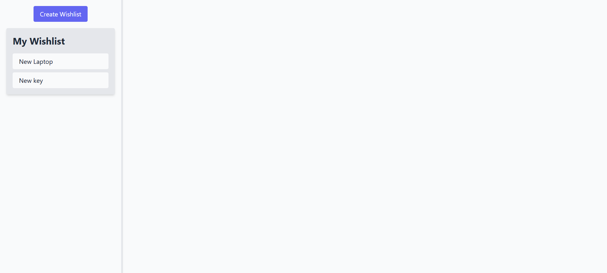
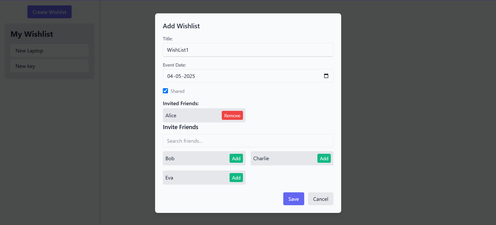
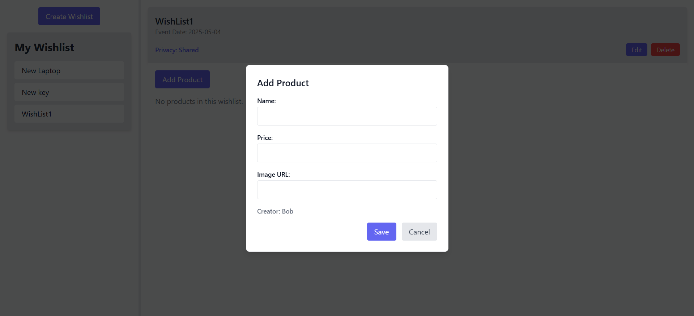
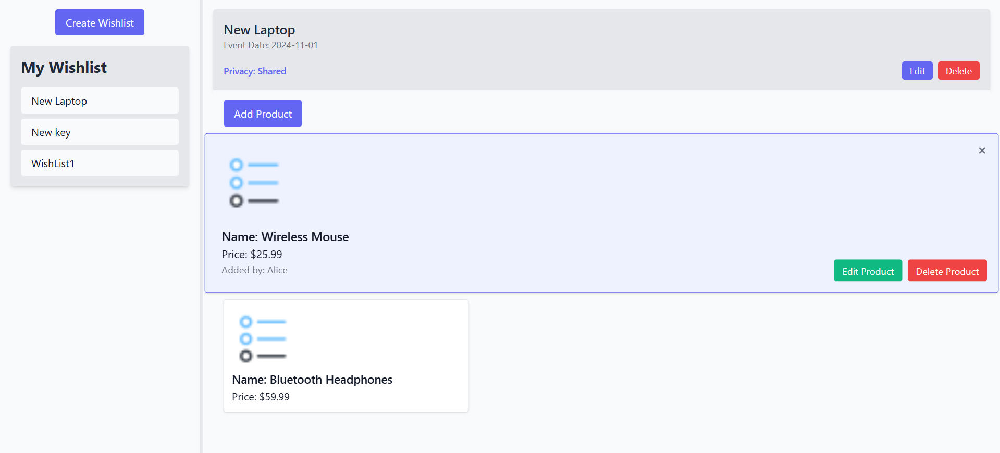
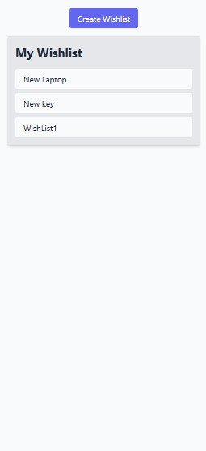
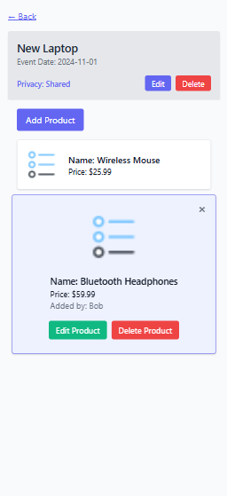

# 🎁 Flock-List [Shared Wishlist App]

A collaborative shopping wishlist app that allows users to create, manage, and share wishlists with friends. Ideal for birthdays, holidays, weddings, and group events.

---

## 📌 Features

### 🔒 Authentication

* Mocked user login/signup (dummy data)

### 📋 Wishlists

* Create, edit, and delete wishlists
* Private or shared wishlists
* Set event date for each wishlist

### 🛍️ Products

* Add, edit, delete products (name, price, image)
* Track which user added/edited each product
* Grid or list view for products

### 👥 Shared Wishlist Support

* Simulated friend invites (mocked search and add)
* View who added each item
* Manage shared users per wishlist

### 💬 Optional Features

* Real-time sync (WebSockets or Firebase Realtime DB)
* Emoji reactions or comments on products
* Responsive design for mobile/tablet

---

## 🧱 Tech Stack

| Layer         | Technology                               |
| ------------- | ---------------------------------------- |
| Frontend      | React                                    |
| State Mgmt    | Context API                              |
| Styling       | Tailwind CSS                             |
| Backend       | Node.js + Express                        |
| Database      | Dummy data inside the Server             |
| Auth (mocked) | Dummy login                              |
| Real-time     | WebSockets (Bonus)                       |

---

## 🚀 Getting Started

### 1. Clone the Repo

```bash
git clone https://github.com/sagardubey14/flocklist.git
cd flocklist
```

### 2. Frontend Setup

```bash
cd client
npm install
npm run dev
```

### 3. Backend Setup

```bash
cd server
npm install
node server.js
```

---

## 🧪 Mock Data & Auth

* Login is mocked . A hardcoded set of users for development.
* Invite feature is simulated (no real email sent).
* Add/remove shared users via dummy APIs.

---
| Screen                      | Preview                                                                                                                                                |
| --------------------------- | ------------------------------------------------------------------------------------------------------------------------------------------------------ |
| **Login Screen**            |                                                                                                                       |
| **Register Screen**         |                                                                                                                 |
| **Main Wishlist View**      |                                                                                                                |
| **Create Wishlist**         |                                                                                                            |
| **Add Product to Wishlist** |                                                                                                            |
| **Product List View**       |                                                                                                          |
| **Responsive Design**       |   |

---

## 🔧 Future Improvements

* Email-based real invitations
* Role-based access (owners vs collaborators)
* Drag-and-drop product ordering
* Offline support with local storage or service workers
* Integration with payment APIs (e.g., Stripe)

---

## 📬 Contact

For questions or suggestions, contact \[[sagardubey353@gmail.com](mailto:sagardubey353@gmail.com)].
